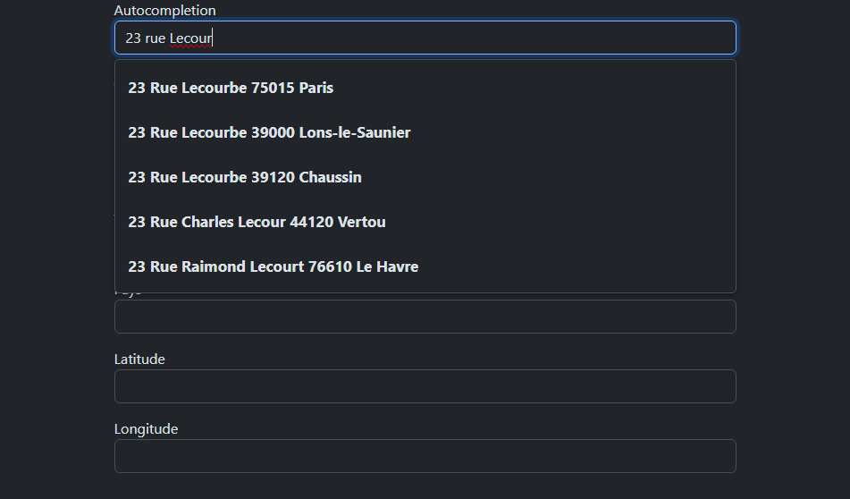

# Adresse-data-gouv-autocomplete

The JavaScript class in autocomplete.js provides autocompletion functionality for an input field using the API from adresse.data.gouv.fr. It allows users to get suggestions for addresses and returns the prediction that the user clicked on.

The index.html is an example of how it works, and how it can be used.

